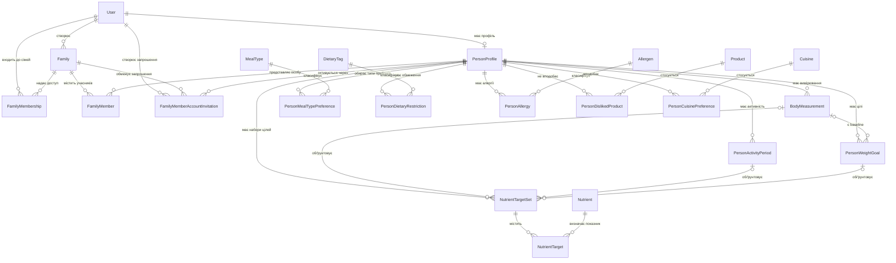
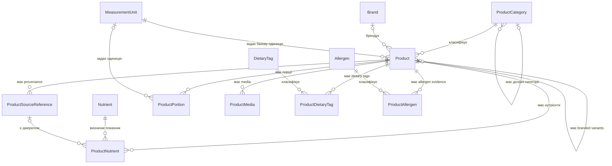
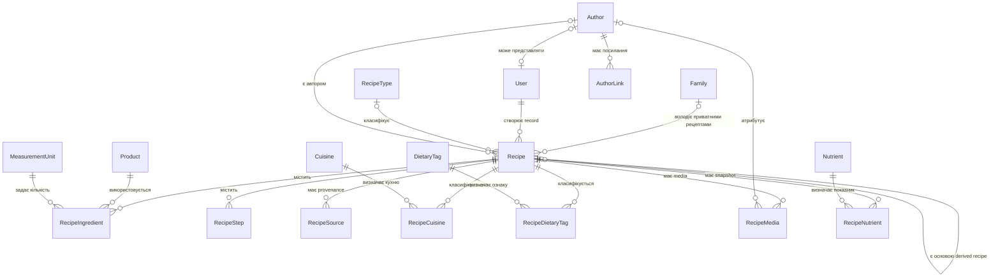
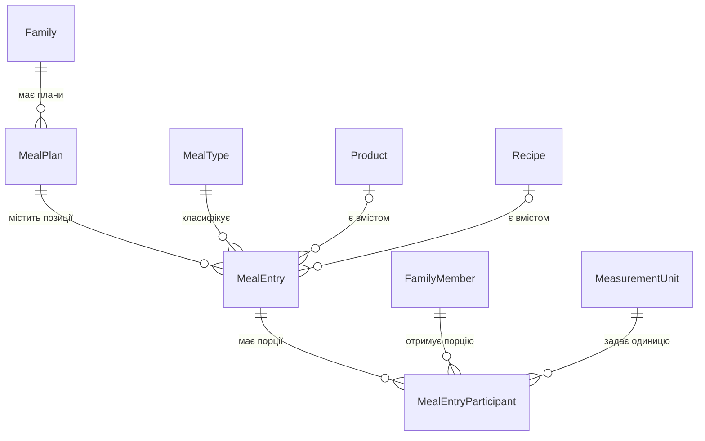
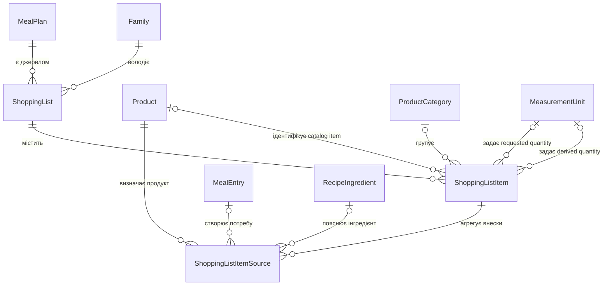
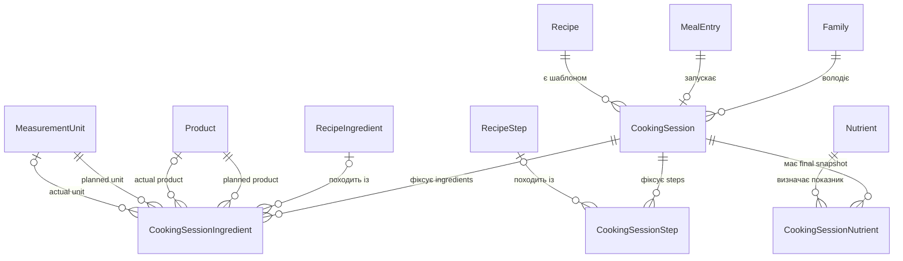
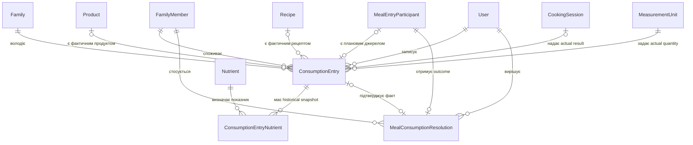

# Доменні ERD

Ці діаграми показують основні предметні зв’язки реалізованої Prisma-схеми. Для читабельності scalar fields, audit relations і частина допоміжних зворотних relations не відображаються. Кардинальність і referential actions потрібно звіряти з `packages/db/prisma/schema.prisma`.

## Identity, Family and Personalization

`FamilyMembership` описує доступ зареєстрованого `User`, а `FamilyMember` — участь `PersonProfile` у плануванні. Завдяки цьому залежний профіль може бути членом сім’ї без облікового запису. `FamilyMemberAccountInvitation` безпечно прив’язує нову verified identity до existing dependent profile, не створюючи нову людину або загальне multi-family invitation.

## Reference Data and Product Catalog

`ProductSourceReference` зберігає provenance імпортованого продукту. Значення нутрієнтів, порції та класифікації можуть посилатися на конкретне джерело, але canonical `Product` не залежить від структури зовнішнього набору.

## Recipes and Nutrition

`createdByUserId` відповідає за audit, тоді як `authorId` визначає публічне авторство. Автор може бути системою, експертом, блогером або зареєстрованим користувачем.

## Meal Planning

`MealEntry` посилається рівно на один content type: product або recipe. Персоналізовані кількості зберігаються окремо у `MealEntryParticipant`.

## Shopping List

Список є збереженим редагованим snapshot. `ShoppingListItemSource` забезпечує traceability від агрегованої позиції до планової порції або ручного внеску.

## Cooking Mode

Cooking session не змінює базовий рецепт. Завершення можливе лише після явного опрацювання ingredient і step snapshots та створення фінального nutrient result.

## Consumption Diary

Планова порція є кандидатом, а не фактом споживання. `MealConsumptionResolution` фіксує outcome, а `ConsumptionEntry` зберігає самостійний історичний факт та його nutrient snapshot.
